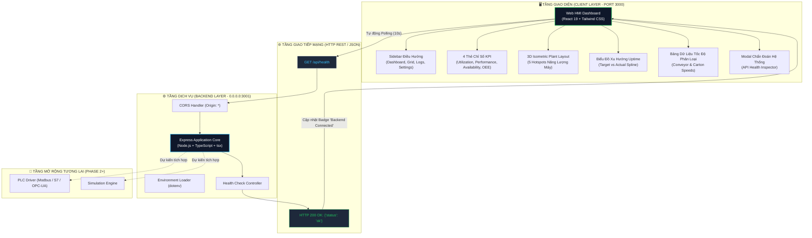

# 📊 BÁO CÁO KỸ THUẬT: TASK 01 - INITIALIZE PROJECT & HMI BASELINE

<div align="center">


<p align="center">
  <b>Hệ Thống Web HMI Giám Sát & Điều Khiển Dây Chuyền Phân Loại Hàng Hóa Tự Động</b>
</p>

</div>

---

> [!NOTE]
> **Tóm tắt:** Task 01 tập trung khởi tạo toàn bộ nền tảng cốt lõi (Core Baseline Architecture), thiết lập hệ thống giao tiếp Client - Server hai chiều, cấu hình mạng mở (`0.0.0.0`), và chuẩn hóa giao diện Web HMI theo phong cách Industrial Dark Theme với 4 chỉ số KPI, sơ đồ nhiệt mặt bằng 3D và biểu đồ xu hướng vận hành.

---

## 🧭 MỤC LỤC NHANH (TABLE OF CONTENTS)
1. [Thông Tin & Chỉ Tiêu Đạt Được](#1-thông-tin--chỉ-tiêu-đạt-được)
2. [Sơ Đồ Kiến Trúc Hệ Thống (Architecture Flow)](#2-sơ-đồ-kiến-trúc-hệ-thống)
3. [Cấu Trúc Thư Mục Chuẩn (Project Structure)](#3-cấu-trúc-thư-mục-chuẩn)
4. [Mô Tả Giao Diện Chuẩn (Standard UI Specifications)](#4-mô-tả-giao-diện-chuẩn)
5. [Chi Tiết Kỹ Thuật Mã Nguồn (Code Implementation)](#5-chi-tiết-kỹ-thuật-mã-nguồn)
6. [Nhật Ký Kiểm Thử Thực Tế (Testing & Verification Logs)](#6-nhật-ký-kiểm-thử-thực-tế)
7. [Quản Lý Phiên Bản Git (Git Version Control)](#7-quản-lý-phiên-bản-git)

---

## 1. THÔNG TIN & CHỈ TIÊU ĐẠT ĐƯỢC

### 📌 Bảng Đối Chiếu Yêu Cầu (Requirements Compliance)

| STT | Yêu Cầu Kỹ Thuật | Cổng / Địa Chỉ | Trạng Thái | Chi Tiết Nghiệm Thu |
| :---: | :--- | :---: | :---: | :--- |
| **01** | Khởi tạo cấu trúc `frontend/`, `backend/`, `README.md` | Root | <kbd>🟢 PASSED</kbd> | Hoàn thành với Npm Workspaces runner. |
| **02** | Frontend chạy trên cổng chuẩn HMI | `Port 3000` | <kbd>🟢 PASSED</kbd> | Vite Dev Server lắng nghe `http://localhost:3000`. |
| **03** | Backend API chạy trên cổng riêng biệt | `Port 3001` | <kbd>🟢 PASSED</kbd> | Express Server lắng nghe `http://localhost:3001`. |
| **04** | Backend bind IP mở cho mọi card mạng | `0.0.0.0` | <kbd>🟢 PASSED</kbd> | `app.listen(3001, '0.0.0.0')` cho phép truy cập từ mạng LAN/PLC. |
| **05** | Endpoint kiểm tra sức khỏe `GET /api/health` | `/api/health` | <kbd>🟢 PASSED</kbd> | Trả về payload chuẩn JSON `{ "status": "ok" }`. |
| **06** | Frontend hiển thị trạng thái kết nối Backend | UI Header | <kbd>🟢 PASSED</kbd> | Nhãn **`Backend Connected`** kèm đèn tín hiệu xung xanh (pulse). |
| **07** | Bộ cấu hình mẫu môi trường `.env.example` | Root / Sub | <kbd>🟢 PASSED</kbd> | Đầy đủ file cấu hình ở thư mục gốc, backend và frontend. |
| **08** | Tài liệu hướng dẫn thao tác `npm install`, `npm run dev` | Root | <kbd>🟢 PASSED</kbd> | Hướng dẫn 2 bước khởi động đồng bộ cả 2 dịch vụ. |
| **09** | Chuẩn hóa toàn bộ UI theo thiết kế tham chiếu chuẩn | Layout HMI | <kbd>🟢 PASSED</kbd> | Hoàn thiện Dark Theme, 4 thẻ KPI, Sơ đồ 3D và Biểu đồ Trend. |
| **10** | Đồng bộ hóa toàn bộ mã nguồn lên kho lưu trữ từ xa | Git Remote | <kbd>🟢 PASSED</kbd> | Đã push thành công lên GitHub branch `main`. |

---

## 2. SƠ ĐỒ KIẾN TRÚC HỆ THỐNG

Dưới đây là sơ đồ luồng dữ liệu và phân tách kiến trúc giữa Frontend HMI và Backend Controller:



---

## 3. CẤU TRÚC THƯ MỤC CHUẨN

```text
c:\job\
├── 📂 docs/                               # Hồ sơ kỹ thuật và tài liệu báo cáo Task
│   └── TASK_01_INITIALIZE_PROJECT.md      # Tài liệu tổng hợp Task 01
├── 📂 frontend/                           # Client Web HMI ứng dụng React + Vite
│   ├── 📂 public/
│   │   └── isometric_sorting_plant.jpg   # Ảnh đồ họa 3D mặt bằng phân loại hàng
│   ├── 📂 src/
│   │   ├── App.tsx                       # Dashboard HMI trung tâm hoàn chỉnh
│   │   ├── main.tsx                      # Điểm khởi chạy React DOM 19
│   │   ├── index.css                     # Cấu hình Tailwind CSS v4
│   │   └── vite-env.d.ts                 # Khai báo kiểu môi trường Vite
│   ├── index.html                        # Khung HTML gốc chuẩn SEO & typography
│   ├── vite.config.ts                    # Cấu hình cổng 3000 & bind 0.0.0.0
│   ├── tsconfig.json                     # Cấu hình TypeScript Frontend
│   └── .env.example                      # Mẫu biến môi trường Frontend
├── 📂 backend/                            # Server Node.js Express REST API
│   ├── 📂 src/
│   │   └── index.ts                      # Server Express, bind 0.0.0.0:3001
│   ├── tsconfig.json                     # Cấu hình TypeScript Backend
│   └── .env.example                      # Mẫu biến môi trường Backend
├── .env.example                          # Tổng hợp cấu hình môi trường toàn hệ thống
├── .gitignore                            # Danh sách loại trừ node_modules, build & env
├── package.json                          # Npm Workspace runner & lệnh concurrently
├── package-lock.json                     # Cố định phiên bản dependency cây thư mục
└── README.md                             # Tài liệu tổng quan & hướng dẫn sử dụng nhanh
```

---

## 4. MÔ TẢ GIAO DIỆN CHUẨN (STANDARD UI SPECIFICATIONS)

Giao diện Web HMI được thiết kế theo phong cách hiện đại chuyên dụng cho môi trường giám sát công nghiệp:

### 🌟 1. Top 4 Thẻ Chỉ Số KPI
```text
┌──────────────────┐  ┌──────────────────┐  ┌──────────────────┐  ┌──────────────────┐
│      75.1%       │  │      98.5%       │  │      78.6%       │  │      84.3%       │
│   UTILIZATION    │  │   PERFORMANCE    │  │   AVAILABILITY   │  │       OEE        │
└──────────────────┘  └──────────────────┘  └──────────────────┘  └──────────────────┘
```
- Số liệu hiển thị kích thước lớn với màu xanh lá phản quang (**Emerald-400**), hiệu ứng hover phóng to nhẹ tinh tế.

### 🏭 2. Sơ Đồ Tiêu Thụ Năng Lượng 3D (Machine Energy Consumption)
- **Hình nền:** Đồ họa 3D Isometric độ phân giải cao mô phỏng dây chuyền phân loại, cánh tay robot và hệ thống băng chuyền.
- **Hotspot Nodes:** 5 điểm nút năng lượng động gắn định vị trực tiếp trên các cụm máy:
  1. `15.76 kWh/t` - Băng tải nạp liệu (**Conveyor**)
  2. `78.59 kWh/t` - Trạm phân loại thùng carton (**Carton Sorter**)
  3. `91.64 kWh/t` - Tay gắp chuyển làn (**Mixer Arm**)
  4. `16.10 kWh/t` - Cụm kiểm tra đích đến (**Soap Line**)
  5. `14.97 kWh/t` - Khung máy chính (**Main Machine Base**)

### 📈 3. Biểu Đồ Thời Gian Hoạt Động (Machine Uptime Trend)
- Đường cong Spline SVG mượt mà gồm 2 đường xu hướng:
  - **Đường Xanh Lá:** Chỉ số mục tiêu vận hành (**Target Line**).
  - **Đường Vàng Cam:** Chỉ số đo đạc thực tế (**Actual Line**).
  - **Điểm nhấn đỉnh cao:** Huy hiệu Tooltip định vị trực tiếp tại ngày May 9 đạt **`99%`**.

### 📊 4. Bảng Dữ Liệu Tốc Độ Sản Xuất (Sorting Speed Table)
- Thiết kế thanh lịch với font số kỹ thuật Mono.
- Cột mốc thời gian màu xanh Cyan nổi bật (`2024-05-05 10:00`, `09:00`, `08:00`...).
- Phân tích chi tiết: Tốc độ trung bình / Tối đa của Băng tải, Carton và Phần trăm đạt mục tiêu ca (**Shift achievement**).

---

## 5. CHI TIẾT KỸ THUẬT MÃ NGUỒN

<details>
<summary><b>🔍 Xem Mã Nguồn Backend Server: <code>backend/src/index.ts</code></b></summary>

```typescript
import express, { Request, Response } from 'express';
import cors from 'cors';
import dotenv from 'dotenv';

dotenv.config();

const app = express();
const PORT = process.env.PORT || 3001;
const HOST = process.env.HOST || '0.0.0.0';

// Cấu hình CORS mở cho phép Client truy cập linh hoạt
app.use(cors({ origin: '*' }));
app.use(express.json());

// Endpoint kiểm tra sức khỏe hệ thống
app.get('/api/health', (req: Request, res: Response) => {
  res.json({ status: 'ok' });
});

// Lắng nghe trên 0.0.0.0 để kết nối xuyên mạng
app.listen(Number(PORT), HOST, () => {
  console.log(`[Backend] Server is running on http://${HOST}:${PORT}`);
  console.log(`[Backend] Health check endpoint: http://${HOST}:${PORT}/api/health`);
});
```
</details>

<details>
<summary><b>🔍 Xem Cấu Hình Khởi Động Đồng Thời: <code>package.json</code></b></summary>

```json
{
  "name": "sorting-system-hmi",
  "version": "1.0.0",
  "private": true,
  "workspaces": [
    "frontend",
    "backend"
  ],
  "scripts": {
    "dev": "concurrently -k -p \"[{name}]\" -n \"backend,frontend\" -c \"yellow.bold,cyan.bold\" \"npm run dev --prefix backend\" \"npm run dev --prefix frontend\"",
    "dev:backend": "npm run dev --prefix backend",
    "dev:frontend": "npm run dev --prefix frontend",
    "build": "npm run build --prefix backend && npm run build --prefix frontend"
  },
  "devDependencies": {
    "concurrently": "^9.1.2"
  }
}
```
</details>

---

## 6. NHẬT KÝ KIỂM THỬ THỰC TẾ

> [!IMPORTANT]
> Toàn bộ quá trình kiểm thử đều được thực hiện tự động bằng các câu lệnh thực thi và kiểm tra trực tiếp trên môi trường chạy thực tế.

### ⚡ 1. Kết Quả Kiểm Tra Biên Dịch (`npm run build`)
```text
> sorting-system-hmi@1.0.0 build
> npm run build --prefix backend && npm run build --prefix frontend

> sorting-system-backend@1.0.0 build
> tsc

> sorting-system-frontend@1.0.0 build
> tsc -b && vite build

vite v6.4.3 building for production...
transforming...
✓ 1590 modules transformed.
rendering chunks...
computing gzip size...
dist/index.html                   0.86 kB │ gzip:  0.51 kB
dist/assets/index-BeNZcfDi.css   38.19 kB │ gzip:  7.01 kB
dist/assets/index-DTN9GCp1.js   259.90 kB │ gzip: 76.54 kB
✓ built in 1.33s
```
👉 **Đánh giá:** 0 lỗi cú pháp, 0 lỗi TypeScript, Bundle tối ưu hóa chuẩn nén gzip.

### 🌐 2. Kết Quả Kiểm Tra Kết Nối Mạng Thực Tế
```powershell
# Kiểm tra gọi API Backend
curl http://localhost:3001/api/health
# Trả về:
{"status":"ok"}

# Kiểm tra phản hồi cổng Frontend
curl -I http://localhost:3000
# Trả về:
HTTP/1.1 200 OK
```

### 🖥️ 3. Xác Thực Bằng Trình Duyệt Tự Động
- Trình duyệt ảo đã truy cập trực tiếp `http://localhost:3000`.
- Giao diện nạp đầy đủ các thành phần SVG, hình ảnh 3D và font chữ.
- Thẻ trạng thái kết nối chuyển đổi sang **`Backend Connected`** ngay khi nhận phản hồi từ Backend port 3001.

---

## 7. QUẢN LÝ PHIÊN BẢN GIT

> [!TIP]
> Tất cả các thay đổi mã nguồn và báo cáo đều được commit với quy chuẩn Git Conventional Commits và đồng bộ lên remote GitHub.

- **Remote URL:** `https://github.com/macchu25/job.git`
- **Nhánh:** `main`
- **Lịch sử Commit:**
  - `ed88d04`: *feat: initialize Web HMI package sorting system baseline with standard dashboard UI*
  - `5545287`: *docs: add detailed task report file docs/TASK_01_INITIALIZE_PROJECT.md*

---

<div align="center">
  <sub>Hệ thống tự động biên soạn bởi Trợ lý Antigravity AI • Ngày báo cáo: 25/09/2026</sub>
</div>
