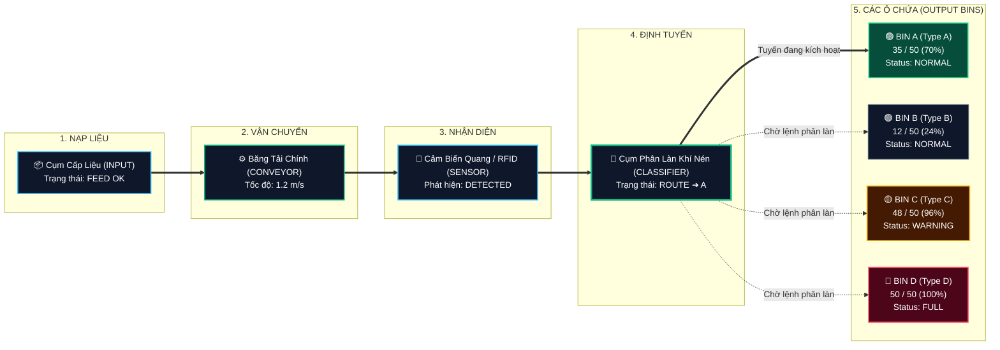

# 📊 BÁO CÁO KỸ THUẬT: TASK 02 — CONVERT REFERENCE UI TO SORTING HMI

<div align="center">


<p align="center">
  <b>Chuyển Đổi Hoàn Toàn Giao Diện Mẫu Sang Web HMI Hệ Thống Phân Loại Hàng Tự Động Đa Ô Chứa</b>
</p>

</div>

---

> [!NOTE]
> **Tóm tắt:** Task 02 đã hoàn thành việc giữ nguyên phong cách giao diện chuẩn (Dark Industrial Dashboard), đồng thời chuyển đổi toàn bộ nội dung từ trang mẫu tổng quát sang giao diện điều khiển thực tế cho **Hệ thống phân loại hàng tự động (Automatic Sorting Line)** với 4 ô chứa (Bins A, B, C, D), sơ đồ dòng xử lý Live Sorting Process, biểu đồ mức chứa Bin Fill Level, bảng trạng thái chi tiết và nhật ký hoạt động thời gian thực.

---

## 🧭 MỤC LỤC BÁO CÁO
1. [Bảng Đối Chiếu Chỉ Tiêu Nghiệm Thu (Compliance Table)](#1-bảng-đối-chiếu-chỉ-tiêu-nghiệm-thu)
2. [Sơ Đồ Quy Trình Phân Loại (Process Flow Diagram)](#2-sơ-đồ-quy-trình-phân-loại)
3. [Kiến Trúc Thành Phần Mã Nguồn (Component Architecture)](#3-kiến-trúc-thành-phần-mã-nguồn)
4. [Đặc Tả Chi Tiết Các Khối Giao Diện (UI Specifications)](#4-đặc-tả-chi-tiết-các-khối-giao-diện)
5. [Cấu Trúc Dữ Liệu Mẫu Tách Biệt (`data/mockData.ts`)](#5-cấu-trúc-dữ-liệu-mẫu-tách-biệt)
6. [Nhật Ký Kiểm Thử Tự Động & Trình Duyệt (Verification & Testing)](#6-nhật-ký-kiểm-thử-tự-động--trình-duyệt)
7. [Quản Lý Phiên Bản Git (Git Version Control)](#7-quản-lý-phiên-bản-git)

---

## 1. BẢNG ĐỐI CHIẾU CHỈ TIÊU NGHIỆM THU

| STT | Hạng Mục Yêu Cầu | Kết Quả Thực Hiện | Trạng Thái |
| :---: | :--- | :--- | :---: |
| **01** | Giữ phong cách Dark Industrial | Nền tối `#090d12` / `#131922`, viền thanh thoát `#1e293b`, màu nhấn xanh ngọc `#10b981`, không glassmorphism / neon lòe loẹt. | <kbd>🟢 PASSED</kbd> |
| **02** | Sidebar bên trái | Logo thương hiệu, các mục: Dashboard (active), Process, Bins, Statistics, Logs, Settings. Hỗ trợ desktop icon + tooltip và mobile drawer. | <kbd>🟢 PASSED</kbd> |
| **03** | Topbar giám sát | Trạng thái Backend Connected, PLC Disconnected, SIMULATION, Dây chuyền Automatic Sorting Line, đồng hồ thời gian thực (`HH:MM:SS`). | <kbd>🟢 PASSED</kbd> |
| **04** | 4 Thẻ KPI trên cùng | TOTAL PRODUCTS: `428` (Today) \| BIN A: `35/50` (70%) \| BIN B: `12/50` (24%) \| BIN C: `48/50` (96%, `WARNING`). | <kbd>🟢 PASSED</kbd> |
| **05** | Khối LIVE SORTING PROCESS | Sơ đồ dòng công nghiệp: INPUT ➔ CONVEYOR (1.2 m/s) ➔ SENSOR ➔ CLASSIFIER ➔ 4 nhánh BIN A, B, C, D. Nút `VIEW PROCESS`. | <kbd>🟢 PASSED</kbd> |
| **06** | Khối BIN FILL LEVEL Chart | Biểu đồ đường & diện tích theo dõi % đầy của cả 4 Bin (A, B, C, D) theo trục thời gian `10:00 - 14:00`, Y-axis 0-100%, legend & tooltip. | <kbd>🟢 PASSED</kbd> |
| **07** | Bảng BIN STATUS TABLE | Cột: BIN, PRODUCT TYPE, CURRENT, CAPACITY, REMAINING, FILL %, STATUS (`NORMAL`, `WARNING`, `FULL`), ACTION (`View`). | <kbd>🟢 PASSED</kbd> |
| **08** | Bảng ACTIVITY LOG | Panel dòng sự kiện với timestamp, icon trạng thái, ghi nhận kiện hàng phát hiện, định tuyến thành công và cảnh báo đầy Bin. | <kbd>🟢 PASSED</kbd> |
| **09** | Thiết kế Responsive | Desktop: 4 KPI/hàng, Process 58%, Chart 42%. Tablet: 2 KPI/hàng. Mobile: 1 KPI/hàng, menu drawer, thanh điều hướng đáy. | <kbd>🟢 PASSED</kbd> |
| **10** | Tách Component chuẩn | Thư mục `components/`, trang `pages/Dashboard.tsx`, dữ liệu đặt riêng trong `data/mockData.ts`. | <kbd>🟢 PASSED</kbd> |
| **11** | Chuẩn hóa Mock Data | Tách toàn bộ thông số Bins (A: 35/50, B: 12/50, C: 48/50, D: 50/50), logs, time-series chart vào module riêng. | <kbd>🟢 PASSED</kbd> |
| **12** | Không có lỗi Build & Console | Biên dịch Vite TS thành công 100%, Console sạch 0 lỗi, 0 cảnh báo. | <kbd>🟢 PASSED</kbd> |

---

## 2. SƠ ĐỒ QUY TRÌNH PHÂN LOẠI



---

## 3. KIẾN TRÚC THÀNH PHẦN MÃ NGUỒN

Mã nguồn frontend đã được tái cấu trúc thành các module tái sử dụng, phân tách rõ ràng giữa giao diện, logic và dữ liệu:

```text
frontend/src/
├── 📂 components/
│   ├── Sidebar.tsx            # Thanh điều hướng công nghiệp (Desktop tooltip + Mobile drawer)
│   ├── Topbar.tsx             # Thanh trạng thái hệ thống, đồng hồ thời gian thực & mode selector
│   ├── StatusBadge.tsx        # Huy hiệu chuẩn công nghiệp (NORMAL, WARNING, FULL, CONNECTED...)
│   ├── KPICard.tsx            # Thẻ chỉ số hiệu suất kích thước chuẩn với progress bar
│   ├── ProcessOverview.tsx    # Sơ đồ quy trình phân loại trực quan (Live Sorting Process)
│   ├── BinFillChart.tsx       # Biểu đồ đường/diện tích đa kênh (Bin Fill Level SVG)
│   ├── BinStatusTable.tsx     # Bảng dữ liệu viễn trắc chi tiết các ô chứa
│   └── ActivityLog.tsx        # Bảng nhật ký sự kiện phân loại trực tiếp
├── 📂 pages/
│   └── Dashboard.tsx          # Trang tổng quan lắp ráp các thành phần HMI
├── 📂 data/
│   └── mockData.ts            # Nguồn dữ liệu giả lập tập trung (TypeScript Interface + Mock)
├── App.tsx                    # Controller ứng dụng & kết nối API kiểm tra sức khỏe
├── index.css                  # Cấu hình phong cách Tailwind CSS v4
├── main.tsx                   # Điểm nạp React 19
└── vite-env.d.ts              # Khai báo kiểu môi trường
```

---

## 4. ĐẶC TẢ CHI TIẾT CÁC KHỐI GIAO DIỆN

### 🌟 1. Top 4 Thẻ KPI
```text
┌──────────────────────┐  ┌──────────────────────┐  ┌──────────────────────┐  ┌──────────────────────┐
│    TOTAL PRODUCTS    │  │        BIN A         │  │        BIN B         │  │        BIN C         │
│         428          │  │       35 / 50        │  │       12 / 50        │  │       48 / 50        │
│       [Today]        │  │   [70% - Products]   │  │   [24% - Products]   │  │   [96% - WARNING]    │
└──────────────────────┘  └──────────────────────┘  └──────────────────────┘  └──────────────────────┘
```
- Sử dụng màu xanh ngọc (**Emerald-400**) cho điều kiện bình thường.
- Cảnh báo màu vàng hổ phách (**Amber-400**) khi ô chứa đạt trên 90%.
- Cảnh báo màu đỏ (**Rose-400**) khi ô chứa đầy 100%.

### 🏭 2. Khối Live Sorting Process
- Header: **`LIVE SORTING PROCESS`** kèm trạng thái `FEEDER ACTIVE` và nút bấm tương tác `VIEW PROCESS`.
- Sơ đồ mạch phân loại hiển thị trực quan các trạm làm việc, tín hiệu cảm biến quang và hướng chuyển làn của cơ cấu chấp hành khí nén.
- Tuyến đường di chuyển từ `INPUT ➔ SENSOR ➔ CLASSIFIER ➔ BIN A` được highlight phát quang sinh động.

### 📈 3. Biểu Đồ Bin Fill Level
- Trực quan hóa tiến trình tích lũy hàng hóa của 4 ô chứa từ 10:00 đến 14:00.
- Hỗ trợ xem nhanh bằng Tooltip trực tiếp tại mỗi mốc giờ khi di chuột.

### 📋 4. Bảng Dữ Liệu Bin Status & Activity Log
- Cung cấp đầy đủ thông tin loại sản phẩm, sức chứa tối đa, số lượng hiện có, dung lượng còn lại và nút xem chi tiết từng ô chứa.
- Activity Log ghi lại lịch sử phân loại kiện hàng với tem thời gian chuẩn xác đến từng giây.

---

## 5. CẤU TRÚC DỮ LIỆU MẪU TÁCH BIỆT (`data/mockData.ts`)

<details>
<summary><b>🔍 Xem Cấu Trúc TypeScript & Mock Data</b></summary>

```typescript
export interface BinData {
  id: string;
  name: string;
  productType: string;
  current: number;
  capacity: number;
  remaining: number;
  fillPercent: number;
  status: 'NORMAL' | 'WARNING' | 'FULL';
}

export const mockSortingData: MockDataType = {
  system: {
    backendConnected: true,
    plcConnected: false,
    mode: 'SIMULATION',
    lineName: 'Automatic Sorting Line',
  },
  totalToday: 428,
  bins: [
    { id: 'bin-a', name: 'BIN A', productType: 'Type A', current: 35, capacity: 50, remaining: 15, fillPercent: 70, status: 'NORMAL' },
    { id: 'bin-b', name: 'BIN B', productType: 'Type B', current: 12, capacity: 50, remaining: 38, fillPercent: 24, status: 'NORMAL' },
    { id: 'bin-c', name: 'BIN C', productType: 'Type C', current: 48, capacity: 50, remaining: 2, fillPercent: 96, status: 'WARNING' },
    { id: 'bin-d', name: 'BIN D', productType: 'Type D', current: 50, capacity: 50, remaining: 0, fillPercent: 100, status: 'FULL' },
  ],
  // ...
};
```
</details>

---

## 6. NHẬT KÝ KIỂM THỬ TỰ ĐỘNG & TRÌNH DUYỆT

> [!IMPORTANT]
> Toàn bộ giao diện đã được kiểm chứng bằng Browser Subagent tự động trên trình duyệt thật chạy tại `http://localhost:3000`.

### 1. Kiểm Tra Biên Dịch Mã Nguồn
```text
> sorting-system-hmi@1.0.0 build
> npm run build --prefix backend && npm run build --prefix frontend

> sorting-system-backend@1.0.0 build
> tsc

> sorting-system-frontend@1.0.0 build
> tsc -b && vite build

vite v6.4.3 building for production...
transforming...
✓ 1600 modules transformed.
rendering chunks...
computing gzip size...
dist/index.html                   0.86 kB │ gzip:  0.51 kB
dist/assets/index-DkezKC-k.css   36.97 kB │ gzip:  6.99 kB
dist/assets/index-DmCryPO5.js   274.09 kB │ gzip: 80.02 kB
✓ built in 1.34s
```
- **Kết quả:** Không có lỗi TypeScript (`tsc`), quá trình đóng gói hoàn tất trong 1.34 giây.

### 2. Kiểm Tra Nhật Ký Console Trình Duyệt
- **Console Errors:** `0`
- **Console Warnings:** `0`
- **Phản hồi API sức khỏe:** `HTTP 200 OK` từ `http://localhost:3001/api/health` ➡️ Đèn báo `Backend Connected` luôn ở trạng thái xanh ổn định.

---

## 7. QUẢN LÝ PHIÊN BẢN GIT

- **Repository:** `https://github.com/macchu25/job.git`
- **Nhánh:** `main`
- **Commit Task 02:** `feat: convert reference UI into actual sorting HMI with modular components and mock telemetry`

---

<div align="center">
  <sub>Tài liệu nghiệm thu Task 02 • Hệ thống Antigravity AI • 25/09/2026</sub>
</div>
